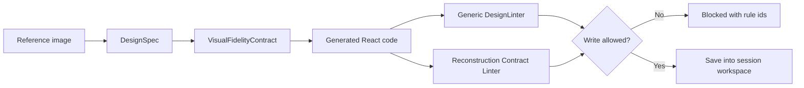

# Manus Harness v1.3.5 Patch Notes

## Summary

v1.3.5 turns the Design Harness from a general UI quality gate into a stricter image reconstruction gate. The patch was driven by the MES dashboard pilot: v1 passed as a plausible dashboard, but it drifted into a dark SaaS redesign instead of preserving the source screenshot. v1.3.5 adds a reconstruction contract so screenshot-to-React jobs can block that drift before code is written.

## Key Changes

- Added `VisualFidelityContract` to the structured `DesignSpec`.
- Added `DesignLinter.lint_reconstruction_contract(code, contract)`.
- Extended `lint_and_write_frontend_code()` with optional `design_contract`.
- Blocks theme drift, such as light source images becoming dark UIs.
- Blocks missing source-image regions, including topbar, sidebar, KPI strip, process flow, production table, alerts, quality queue, equipment table, and work order table.
- Blocks missing required labels/OCR text.
- Blocks insufficient KPI count.
- Blocks insufficient table count.
- Blocks insufficient data density when `strict_density=True`.
- Improved reconstruction row counting for array-of-object and array-of-array table data.
- Improved error messages to include the failing rule id.

## Why This Patch Exists

Prompt-only control was not enough. The model could still reinterpret the screenshot as a nicer but less faithful interface. v1.3.5 makes fidelity measurable and enforceable:



## Contract Fields

- `theme_mode`: `light`, `dark`, `mixed`, or `unknown`.
- `required_regions`: source layout regions that must be represented.
- `required_text`: source labels/text that must appear.
- `required_kpi_labels`: KPI labels that must appear.
- `min_table_count`: minimum table-like structures.
- `min_kpi_count`: minimum KPI count.
- `min_data_rows`: minimum data/list/table rows.
- `strict_density`: when true, low data density becomes blocking.

## Verification

- Unit/integration suite: `21 passed`.
- MES v2 pilot:
  - `pnpm build`: passed.
  - Generic `DesignLinter`: `True 0`.
  - Reconstruction contract: `True 0`.
  - Browser QA: console `errors=[]`, `warnings=[]`.
  - Desktop: `innerWidth=1440`, `scrollWidth=1440`.
  - Mobile: `innerWidth=390`, `scrollWidth=390`.

## Compatibility

This is a backward-compatible patch. Existing callers can keep using:

```python
lint_and_write_frontend_code(session_id, code, file_path)
```

Screenshot reconstruction jobs can opt into stricter checks:

```python
lint_and_write_frontend_code(
    session_id,
    code,
    file_path,
    design_contract={
        "theme_mode": "light",
        "required_regions": ["topbar", "sidebar", "kpi_strip"],
        "required_text": ["OEE", "Throughput", "Work Orders"],
        "min_table_count": 1,
        "min_kpi_count": 3,
        "strict_density": True,
    },
)
```
